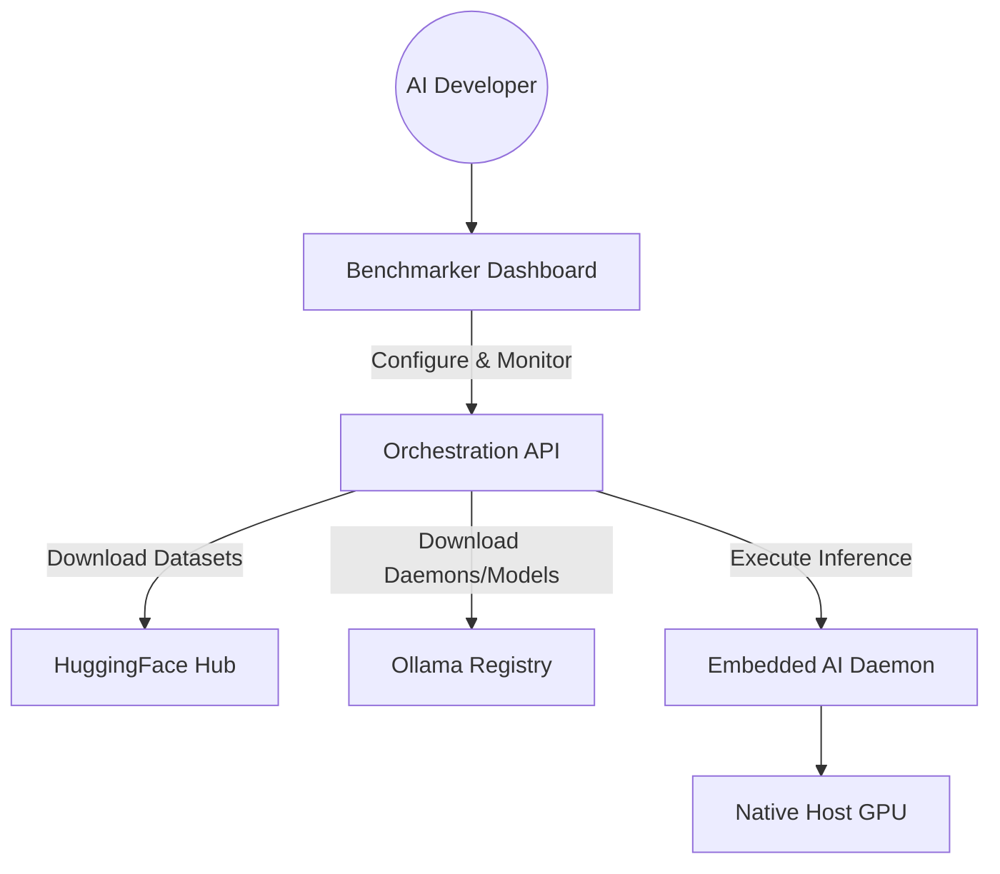
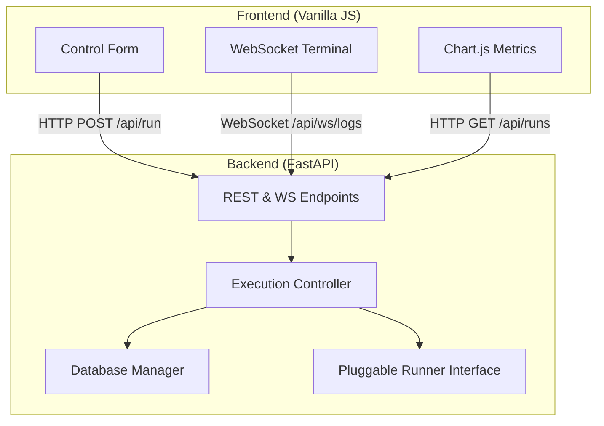
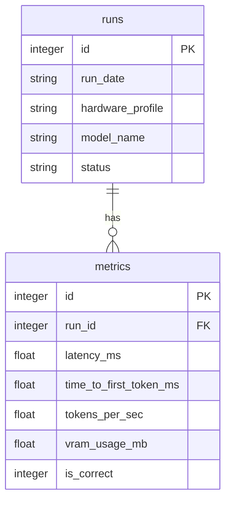
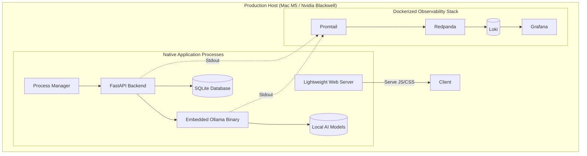
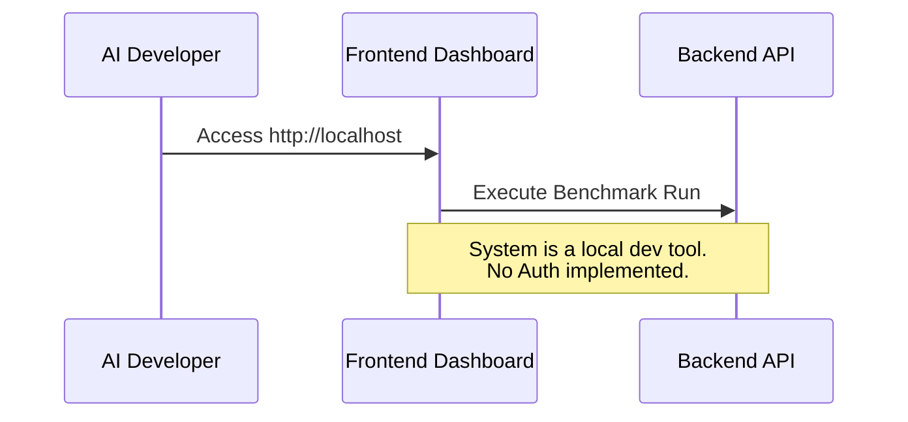

# System Architecture Document

## 1. Introduction
### 1.1 Purpose
This document provides a comprehensive architectural overview of the Benchmarker application. It maps the system’s structures and technological decisions against ISO 42010 viewpoints to satisfy stakeholder concerns regarding deployment, data handling, execution performance, and observability.

### 1.2 Scope
This architecture covers the complete Benchmarker harness, including the Vanilla JS/Vite frontend dashboard, the Python/FastAPI orchestration backend, the embedded AI Runner daemon (Ollama), the SQLite telemetry store, and the containerized observability stack (Loki, Grafana, Redpanda).

### 1.3 References
- **PRD:** [PRD](./prd.md)
- **SRS:** [SRS](./srs.md)
- **Implementation Plan:** [Project Plan](./plan.md)
- **ADRs:** [ADRs](./architecture/)

### 1.4 Architectural Principles
- **Local-First & Data Sovereignty:** All model execution, data processing, and telemetry storage occur strictly on the local machine. No external cloud inference.
- **Scale-to-Zero:** The system consumes zero active resources when not benchmarking. AI model daemons are embedded and spun up/down dynamically.
- **Zero-Friction Setup:** Automated downloading of datasets, runner binaries, and model weights without requiring complex system-level installations.
- **Observability First:** All application logs are pushed unbuffered to `stdout` to be consumed by a modern, centralized event-streaming stack.
- **Native Hardware Acceleration:** The core application bypasses Docker in production to guarantee direct access to native GPU drivers (Apple Metal, Nvidia CUDA).

## 2. Context & Stakeholder Viewpoint (ISO 42010)
*Addresses: Who interacts with the system, external dependencies, and what the key stakeholder concerns are.*

### 2.1 Stakeholders & Concerns
- **AI Developers:** Require deterministic, reproducible benchmark execution, automated dataset handling, and precise graphical reporting for model evaluation.
- **System Operators:** Require an easy-to-deploy stack that leverages their specific hardware (Mac M5, Nvidia Blackwell) without virtualization bottlenecks.

### 2.2 Context Diagram

## 3. Functional/Logical Viewpoint (ISO 42010)
*Addresses: How the system is subdivided into modules, their responsibilities, and how they interact logically.*

### 3.1 Logical Architecture

### 3.2 Frontend Architecture
- **Framework & Technologies:** Vanilla JS, CSS (Glassmorphism design), HTML, Vite (Bundler), Chart.js (Visualizations).
- **Key Design Patterns:** Event-driven UI updates, WebSocket log streaming, dynamic origin resolution (`window.location.host`) for portability.

### 3.3 Backend Architecture
- **Framework & Technologies:** Python 3.12, FastAPI, Uvicorn, HuggingFace `datasets`.
- **API Style:** REST for configuration/metrics, WebSockets for live daemon logging.
- **Directory Structure Overview:** 
  - `apps/backend/app/api`: FastAPI routers and dependency injection.
  - `apps/backend/app/modules/execution`: The Pluggable AI runner logic and batch orchestrator.
  - `apps/backend/app/modules/persistence`: SQLite database management and metric calculations.

## 4. Information/Data Viewpoint (ISO 42010)
*Addresses: Data structures, database systems, permanence, caching, and data flow.*

### 4.1 Data Architecture

### 4.2 Database Decisions
- **Primary Database:** SQLite (Serverless, local file-based).
- **Schema Management:** Automated table creation on startup by the `DatabaseManager` if tables do not exist.
- **Storage Strategy:** All historical benchmarks are saved durably to `benchmarker.sqlite` to allow historical chart generation.

## 5. Deployment/Physical Viewpoint (ISO 42010)
*Addresses: How the logical components are mapped onto physical hardware, cloud instances, or container networks.*

### 5.1 Infrastructure Architecture

### 5.2 CI/CD & Testing
- **Backend Testing:** `behave` for BDD scenario validation, with `Allure` reporting.
- **Frontend Testing:** `playwright-bdd` for native UI testing against production builds, utilizing strict DOM assertions and API mocking.
- **Code Quality:** Enforced via `ruff` for Python and `eslint`/`prettier` for JS.

## 6. Security Viewpoint (ISO 42010)
*Addresses: Threat vectors, authentication boundaries, and data protection mechanisms.*

### 6.1 Authentication Flow

### 6.2 Security Measures
- **Network Boundaries:** The application listens on `0.0.0.0` (exposing the service on all network interfaces). While this makes it accessible across the local network, it is strictly an internal tool and is not intended for exposure to the public internet without additional security controls (e.g., a firewall or reverse proxy).
- **Data Privacy:** Because the AI runners are downloaded and executed locally on the host machine, no proprietary dataset text or model responses are ever sent over external networks.

## 7. Performance & Concurrency Viewpoint (ISO 42010)
*Addresses: Scalability, error handling, rate limiting, and system observation mechanisms.*

### 7.1 Scalability Constraints
- **Known Bottlenecks:** The single local GPU bounds concurrent inference operations. SQLite relies on file-level locks for writing.
- **Mitigation:** The system mitigates SQLite lock contention during concurrent benchmarking by utilizing Write-Ahead Logging (WAL) and streaming result writes. The backend orchestrator utilizes asynchronous threading to dispatch concurrent inference requests (up to a UI-defined limit), enabling true load testing against runners like vLLM. API endpoints performing heavy database queries (`/api/runs`) are defined synchronously so FastAPI offloads them to a threadpool, preventing event-loop blocking.

### 7.2 Observability & Monitoring
- **Logging Subsystems:** Python applications stream logs unbuffered directly to `stdout`.
- **Telemetry Pipeline:** Promtail scrapes the host stdout streams, pushing to Redpanda (Kafka-compatible buffer), which flushes into Loki for querying via Grafana.

## 8. Technology Decisions Summary
| Layer | Technology | Rationale (Driven by ADRs) |
|-------|------------|-----------|
| **Deployment Strategy** | Native Bare-Metal | [[ADR-010](./architecture/010-native-bare-metal-deployment.md)] Required to guarantee native GPU (Metal/CUDA) access for the embedded AI daemon, as Docker Mac does not support Metal passthrough. |
| **Frontend UI** | Vanilla JS / Vite | [[ADR-003](./architecture/003-coding-style-and-linting.md)] Minimal dependency footprint, "Glassmorphism" premium aesthetic, and zero-friction build pipeline. |
| **Backend API** | Python / FastAPI | Follows the Python/JS Monorepo initialization; FastAPI provides asynchronous routing and WebSocket support for live log streaming. |
| **Execution Engine** | Embedded Ollama / vLLM | [[ADR-008](./architecture/008-embed-ollama-daemon.md)] Embedding the daemon prevents system conflicts and fulfills the Zero-Friction/Local-First mandates. Pluggable via [ADR-009](./architecture/009-pluggable-ai-runner-architecture.md) and concurrent-capable via [ADR-011](./architecture/011-concurrent-inference-and-vllm.md). |
| **Data Source** | HuggingFace Datasets | [[ADR-007](./architecture/007-use-huggingface-datasets.md)] Standardizes access to RVL-CDIP, FUNSD, and SROIE without custom parsers. |
| **Telemetry Store** | SQLite | [[ADR-006](./architecture/006-use-sqlite-for-datastore.md)] Serverless, zero-friction storage. Concurrent benchmarking writes are coordinated via WAL plus sufficient timeout configuration ([ADR-011](./architecture/011-concurrent-inference-and-vllm.md)). |
| **Observability** | PLG Stack + Redpanda | [[ADR-004](./architecture/004-centralized-observability.md)] Modern, robust event-streaming architecture. Containerized to separate infrastructure from the application. |
